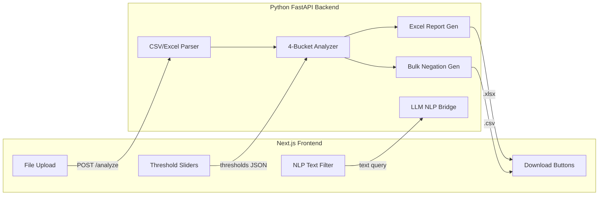

# Amazon PPC Search Term Analyzer - Full Build Plan

## Overview

Build a full-stack "Amazon PPC Search Term Analyzer" that ingests Amazon SP Search Term Reports, categorizes terms into 4 performance buckets using pandas, outputs a 5-sheet analysis Excel workbook and an Amazon-format bulk negation file, with a Next.js/Tailwind frontend and optional LLM-powered NLP filtering.

## Architecture



## Data Schema (from provided sample files)

**Input: SPSTR columns** (from `SPSTR - Bulk.xlsx.pdf`):
`Product`, `Campaign ID`, `Ad Group ID`, `Keyword ID/Product Targeting ID`, `Campaign Name (Informational only)`, `Ad Group Name (Informational only)`, `Portfolio Name (Informational only)`, `State`, `Campaign State (Informational only)`, `Bid`, `Keyword Text`, `Match Type`, `Product Targeting Expression`, `Resolved Product Targeting Expression (Informational only)`, `Customer Search Term`, `Impressions`, `Clicks`, `Click-through Rate`, `Spend`, `Sales`, `Orders`, `Units`, `Conversion Rate`, `ACOS`, `CPC`, `ROAS`

- Match Type values: `Exact`, `Phrase`, `Broad`, `close-match` (auto targeting)
- ACOS / CVR / CTR: percentage strings like `"1.84%"` -- must parse to decimals
- CVR: explicit `Conversion Rate` column exists in the report

**Output: Negation Bulk columns** (from `negation bulk - search terms.xlsx.pdf`):
`Product`, `Entity`, `Campaign Name (Informational only)`, `Ad Group Name (Informational only)`, `Portfolio Name (Informational only)`, `State`, `Campaign State (Informational only)`, `Ad Group State (Informational only)`, `Keyword Text`, `Match Type`, `Impressions`, `Clicks`, `Click-through Rate`, `Spend`, `Sales`, `Orders`, `Units`, `Conversion Rate`, `ACOS`, `CPC`, `ROAS`

- Entity: `"Campaign Negative Keyword"`
- Match Type: `"Negative Exact"`
- `Keyword Text`: the wasted `Customer Search Term`
- All metrics: `0`
- Campaign/Portfolio: preserved from source SPSTR row

## Project Structure

```
amazon-ppc-analyzer/
├── backend/
│   ├── requirements.txt
│   ├── app/
│   │   ├── __init__.py
│   │   ├── main.py              # FastAPI app (Step 4)
│   │   ├── analyzer.py          # Core 4-bucket analysis engine
│   │   ├── exporter.py          # 5-sheet Excel report generator
│   │   ├── bulk_generator.py    # Amazon bulk negation CSV generator
│   │   └── nlp_filter.py        # LLM NLP filter (Step 5)
│   └── tests/
│       ├── test_analyzer.py
│       └── generate_dummy_data.py
├── frontend/                     # Next.js + Tailwind (Step 3)
│   └── ...
└── README.md
```

---

## Step 1: Backend Core Logic (IMMEDIATE)

Create `backend/app/analyzer.py` with class `SearchTermAnalyzer`:

- `load_data(file_path_or_buffer)` -- reads Excel/CSV into a pandas DataFrame
- `_normalize_percentages()` -- converts `"1.84%"` strings to `0.0184` floats for `ACOS`, `Conversion Rate`, `Click-through Rate`
- `_drop_impression_share()` -- removes Impression Share column if present
- `filter_wasted_adspend(click_threshold=10)` -- `Clicks >= click_threshold AND Orders == 0`
- `filter_inefficient_adspend(acos_threshold=0.30)` -- `ACOS >= acos_threshold AND Orders > 0`
- `filter_scaling_opportunity(cvr_threshold=0.10, low_click_threshold=10)` -- `Match Type == 'Exact' AND Conversion Rate >= cvr_threshold AND Clicks <= low_click_threshold`
- `filter_harvesting_opportunity(order_threshold=2)` -- `Match Type NOT IN ['Exact','Phrase','Broad'] AND Orders > order_threshold`
- `analyze(thresholds_dict)` -- runs all 4 filters, returns dict of DataFrames

Also create `backend/tests/generate_dummy_data.py` that produces a realistic 100-row dummy SPSTR CSV covering all 4 categories, and `backend/tests/test_step1.py` that runs the analyzer and prints results.

**Output columns for each category sheet**: `Customer Search Term`, `Campaign Name (Informational only)`, `Ad Group Name (Informational only)`, `Match Type`, `Impressions`, `Clicks`, `Orders`, `Spend`, `Sales`, `ACOS`, `Conversion Rate`

---

## Step 2: Backend Export Logic

- `backend/app/exporter.py` -- generates a 5-sheet `.xlsx` workbook using `openpyxl`:
  - Sheet 1: "Summary Dashboard" -- aggregate counts, totals, averages per category
  - Sheets 2-5: one per category with the filtered data
  - Professional formatting (headers, number formats, conditional highlighting)

- `backend/app/bulk_generator.py` -- generates Amazon-format bulk negation CSV:
  - Pulls from Wasted Adspend results
  - Matches exact column order from the provided negation sample
  - `Entity = "Campaign Negative Keyword"`, `Match Type = "Negative Exact"`, all metrics = 0
  - Preserves Campaign Name + Portfolio Name from source row

---

## Step 3: Frontend (Next.js + Tailwind)

- File upload dropzone (accepts `.xlsx`, `.csv`)
- Dynamic threshold sliders: Click threshold, ACOS threshold, CVR threshold, Low click threshold, Order threshold
- Real-time preview of category counts after analysis
- Download buttons for: Analysis Report (.xlsx) and Bulk Negation File (.csv)
- Modern, dark-mode-friendly UI

---

## Step 4: Integration (FastAPI + Next.js)

- `backend/app/main.py` -- FastAPI endpoints:
  - `POST /api/analyze` -- accepts file upload + threshold params, returns category counts + session ID
  - `GET /api/download/report/{session_id}` -- streams the Excel report
  - `GET /api/download/bulk/{session_id}` -- streams the bulk CSV
- Next.js API calls via fetch to the FastAPI backend
- CORS configuration for local development

---

## Step 5: MLend (LLM NLP Integration)

- `backend/app/nlp_filter.py` -- accepts natural language text, sends to LLM API (OpenAI recommended), receives a pandas query string, executes against the DataFrame
- Example: user types "Show me terms with more than 50 clicks and spend over $100" -> LLM generates `df[(df['Clicks'] > 50) & (df['Spend'] > 100)]`
- Safety: sandboxed execution, whitelist of allowed DataFrame operations

---

## Execution Checklist

| Step | Task | Status |
|------|------|--------|
| 1a | Create `generate_dummy_data.py` -- 100-row dummy SPSTR CSV | Pending |
| 1b | Create `analyzer.py` -- SearchTermAnalyzer with 4 filter methods | Pending |
| 1c | Create `test_step1.py` -- test script with hardcoded thresholds | Pending |
| 1d | Create `requirements.txt` | Pending |
| 2a | Create `exporter.py` -- 5-sheet Excel workbook | Pending |
| 2b | Create `bulk_generator.py` -- Amazon bulk negation CSV | Pending |
| 3 | Scaffold Next.js + Tailwind frontend | Pending |
| 4 | Create FastAPI backend and connect to frontend | Pending |
| 5 | Integrate LLM API for NLP filtering | Pending |
